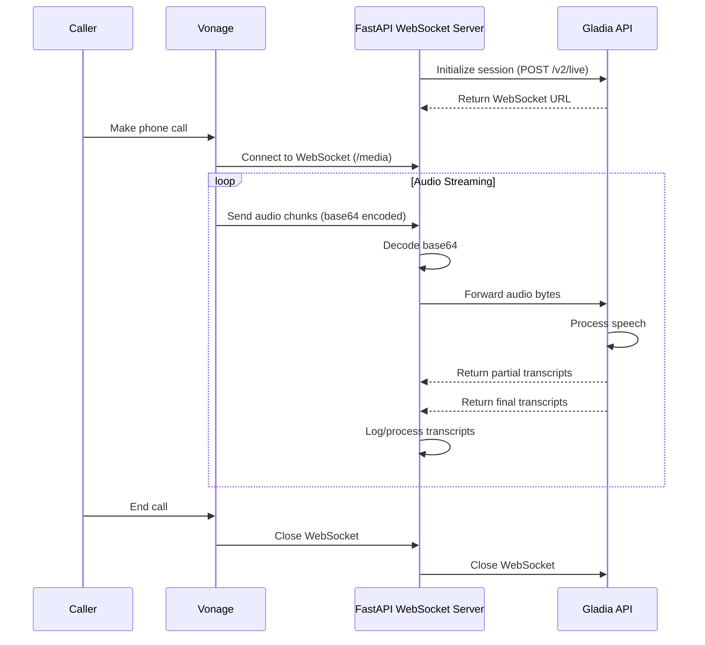

## How to Transcribe Vonage Calls in Real Time with FastAPI and Python & Gladia

Vonage's Voice APIs deliver audio via WebSockets that can be configured for various formats. Gladia's real-time Speech-to-Text (STT) API is flexible enough to handle this audio with minimal processing, enabling you to build real-time transcription with sub-300 ms latency.

Gladia's `/v2/live` endpoint lets you specify multiple audio format configurations to match what Vonage delivers ([Gladia][1]).

---

### Prerequisites

| What you need                             | Why                                                                  |
| ----------------------------------------- | -------------------------------------------------------------------- |
| **Gladia API key**                        | Sign up & copy from the dashboard.                                   |
| **Vonage account + voice-enabled number** | To receive / place calls.                                            |
| **Python 3.12+**                          | We'll use `fastapi`, `uvicorn`, `websockets`, and `requests`.       |
| **Public URL**                            | Expose a WebSocket endpoint with ngrok or a cloud VM.                |
| **Audio format from Vonage**              | Typically Linear PCM (L16) but configurable in Vonage's NCCO.        |

---

### 1 — Initiate a Gladia live session

```python
import os
import requests
from dotenv import load_dotenv

# Load environment variables
load_dotenv()

GLADIA_KEY = os.getenv("GLADIA_API_KEY")
GLADIA_INIT = "https://api.gladia.io/v2/live"

def create_session():
    """Initialize a Gladia real-time transcription session."""
    payload = {
        "encoding": "wav/pcm",  # For Vonage's Linear PCM 
        "sample_rate": 8000,     # Standard telephony sample rate
        "channels": 1,
    }
    
    r = requests.post(
        GLADIA_INIT,
        json=payload,
        headers={
            "X-Gladia-Key": GLADIA_KEY,
            "Content-Type": "application/json",
        },
        timeout=10,
    )
    r.raise_for_status()
    data = r.json()
    print("🛰  Gladia session ID:", data["id"])
    return data["url"]  # wss://api.gladia.io/v2/live?token=…
```

> **Note on audio format:** Vonage WebSockets typically send L16 PCM audio by default. Gladia can process this directly or you can configure Vonage to send other formats.

---

### System Architecture Flow

Here's how data flows through the system:



---

### 2 — Build the Python WebSocket proxy

The proxy does **three** things:

1. Accept Vonage's base64-encoded audio frames.
2. Base64-decode the audio data.
3. Pipe the bytes straight to Gladia and print transcripts as they come back.

```python
# server.py
import os
import base64
import json
import logging
import asyncio
import websockets
import requests
from fastapi import FastAPI, WebSocket
from dotenv import load_dotenv
import uvicorn

# Load environment variables
load_dotenv()

GLADIA_KEY = os.getenv("GLADIA_API_KEY")
GLADIA_INIT = "https://api.gladia.io/v2/live"
# Convert HTTP_PORT to integer
HTTP_PORT = int(os.getenv("HTTP_PORT", "5000"))

# Configure logging
logging.basicConfig(level=logging.INFO)
logger = logging.getLogger(__name__)

app = FastAPI()

# Store gladia session information
gladia_session = {
    "id": None,
    "url": None,
}

def create_session():
    """Initialize a Gladia real-time transcription session."""
    payload = {
        "encoding": "wav/pcm",  # For Vonage's Linear PCM
        "sample_rate": 8000,     # Standard telephony sample rate
        "channels": 1,
    }

    try:
        r = requests.post(
            GLADIA_INIT,
            json=payload,
            headers={
                "X-Gladia-Key": GLADIA_KEY,
                "Content-Type": "application/json",
            },
            timeout=10,
        )
        r.raise_for_status()
        data = r.json()
        logger.info("🛰  Gladia session ID: %s", data["id"])
        gladia_session["id"] = data["id"]
        gladia_session["url"] = data["url"]
        return data["url"]  # wss://api.gladia.io/v2/live?token=…
    except requests.exceptions.RequestException as e:
        logger.error("Failed to create Gladia session: %s", e)
        raise

# Create initial Gladia session
try:
    create_session()
except Exception as e:
    logger.error("Failed to create initial Gladia session: %s", e)
    raise

@app.get("/health")
def health_check():
    return {"status": "ok", "service": "vonage-gladia-transcription"}

@app.websocket("/media")
async def media(websocket: WebSocket):
    """Handle incoming WebSocket connections from Vonage."""
    await websocket.accept()
    client = websocket.client
    client_info = f"{client.host}:{client.port}"
    logger.info(f"🔌 Vonage WebSocket connected from {client_info}")
    
    await handle_websocket(websocket)

async def process_message(ws_message, gladia_ws):
    """Process a message asynchronously."""
    try:
        data = json.loads(ws_message)
        
        # Vonage WebSocket sends audio data with a different structure
        # Check if this is audio data from Vonage
        if "content" in data and data.get("content", {}).get("encoding") == "audio/l16;rate=8000":
            # Extract audio data and convert from base64
            audio_payload = base64.b64decode(data["content"]["data"])
            
            # Send the audio data to Gladia
            await gladia_ws.send(audio_payload)
        else:
            logger.debug(f"Non-audio event: {json.dumps(data)[:100]}...")
            return  # ignore non-audio events

        # Check for transcripts
        try:
            # Try to get transcripts (non-blocking)
            while True:
                resp = await asyncio.wait_for(gladia_ws.recv(), 0.001)
                handle_gladia(resp)
        except asyncio.TimeoutError:
            pass  # No transcript available yet
    except Exception as e:
        logger.error(f"Error processing message: {e}")

def handle_gladia(msg):
    """Process transcription results from Gladia."""
    m = json.loads(msg)
    if m["type"] == "transcript" and m["data"]["is_final"]:
        transcript = m["data"]["utterance"]["text"]
        print(f"📝 Transcript: {transcript}")
        return transcript
```

With proper asynchronous handling for high performance.

---

### 3 — Configure Vonage to stream audio

Create an NCCO (Nexmo Call Control Object) in your Vonage dashboard like:

```xml
<?xml version="1.0" encoding="UTF-8"?>
<ncco>
  <websocket>
    <uri>wss://jl.mydomain.com/media</uri>
    <contentType>audio/l16;rate=8000</contentType>
  </websocket>
  <connect>
    <endpoint>
      <type>phone</type>
      <number>14155551234</number>
    </endpoint>
  </connect>
</ncco>
```

Let's examine each element in this NCCO configuration:

- `<ncco>`: The root element of any Vonage NCCO document. It contains all the instructions for handling the call.

- `<websocket>`: This element configures a WebSocket connection for streaming audio:
  - `<uri>`: Specifies the WebSocket endpoint where Vonage will send the audio data.
  - The URL must use secure WebSockets (`wss://`).
  - The domain should be your public domain (e.g., an ngrok URL or a custom domain).
  - The path (`/media`) must match the WebSocket route in your FastAPI application.
  - Each call will create a new WebSocket connection to this endpoint.
  - `<contentType>`: Specifies the audio format that Vonage will send (Linear PCM at 8kHz in this case).

- `<connect>`: This element connects the caller to another phone number:
  - During this connection, the media streaming continues in the background.
  - Audio from both sides of the conversation is sent to your WebSocket endpoint.
  - The number shown (`14155551234`) is just an example - replace it with your desired destination.

When a call triggers this NCCO, Vonage immediately opens a secure WebSocket connection to your server's `/media` endpoint and begins streaming audio. Each audio chunk is base64-encoded and sent as a JSON message, which your server then decodes and forwards to Gladia.

---

### 4 — Expose & test

```bash
# Install dependencies
pip install -r requirements.txt

# Run the proxy (default port 5000)
python server.py

# Or specify a custom port
HTTP_PORT=5001 python server.py

# Tunnel it with ngrok
ngrok http 5000

# Or with a custom domain
ngrok http --domain=your.domain.com 5000
```

Call your Vonage number and you should see live text scroll instantly:

```
🛰  Gladia session ID: 3f65…
🚀  Starting server on 0.0.0.0:5000
🔌 Vonage WebSocket connected from 54.174.99.133:12345
📝 Transcript: Hello and thank you for calling Acme support.
📝 Transcript: Sure, I'd be happy to help with your order.
```

---

### 5 — Next steps

* **Add-ons** – enable diarization, sentiment, keywords, etc., by including the flags when you create the session.
* **Dual-channel** – Vonage can stream separate channels; Gladia preserves them so you always know who's speaking.
* **Post-call JSON** – store the session `id` and hit `GET /v2/live/:id` for the full, punctuated transcript when the call ends.
* **Scale it** – FastAPI with Uvicorn is production-ready, but for even higher loads, consider deploying with Gunicorn as a process manager.

---

### Wrap-up

Real-time call transcription with Vonage and Gladia is simple and straightforward. With just a decode and forward approach, you can quickly add speech-to-text capabilities to your Vonage applications. The minimal processing needed means lower CPU usage and lightning-fast latency. Drop this proxy into any Python stack and start surfacing live insights from every call. Happy building! 🎙️📝

[1]: https://docs.gladia.io/api-reference/v2/live/init "Initiate a session - Gladia"