## How to Transcribe Twilio Calls in Real Time with Go & Gladia (μ-law Native)

Twilio's Voice **Media Streams** deliver 8 kHz, 8-bit μ-law audio. Gladia's real-time Speech-to-Text (STT) API now ingests that exact format out-of-the-box, so you can skip every resample or decode step and still keep sub-300 ms latency.

Gladia's `/v2/live` endpoint lets you specify **`encoding: "wav/ulaw"`** with **`bit_depth: 8`**, matching Twilio 1-for-1 ([Gladia][1]).

---

### Prerequisites

| What you need                             | Why                                                                  |
| ----------------------------------------- | -------------------------------------------------------------------- |
| **Gladia API key**                        | Sign up & copy from the dashboard.                                   |
| **Twilio account + voice-enabled number** | To receive / place calls.                                            |
| **Go 1.18.1+**                              | We'll use `gorilla/websocket` for WebSocket handling.                |
| **Public URL**                            | Expose a WebSocket endpoint with ngrok or a cloud VM.                |
| **8 kHz, 8-bit μ-law audio**              | Exactly what Twilio streams – and what Gladia now consumes natively. |

---

### 1 — Initiate a Gladia live session

```go
import (
    "bytes"
    "encoding/json"
    "fmt"
    "io"
    "log"
    "net/http"
    "time"
)

const (
    gladiaInitURL = "https://api.gladia.io/v2/live"
)

// GladiaSession stores session information
type GladiaSession struct {
    ID  string `json:"id"`
    URL string `json:"url"`
}

// createSession initializes a Gladia real-time transcription session and returns the WebSocket URL.
func createSession() (GladiaSession, error) {
    payload := map[string]interface{}{ // μ-law, 8-bit, 8 kHz, mono
        "encoding":    "wav/ulaw",
        "bit_depth":   8,
        "sample_rate": 8000,
        "channels":    1,
    }
    body, err := json.Marshal(payload)
    if err != nil {
        return GladiaSession{}, fmt.Errorf("failed to marshal payload: %w", err)
    }
    req, err := http.NewRequest("POST", gladiaInitURL, bytes.NewReader(body))
    if err != nil {
        return GladiaSession{}, fmt.Errorf("failed to create request: %w", err)
    }
    req.Header.Set("X-Gladia-Key", gladiaAPIKey)
    req.Header.Set("Content-Type", "application/json")
    client := &http.Client{Timeout: 10 * time.Second}
    resp, err := client.Do(req)
    if err != nil {
        return GladiaSession{}, fmt.Errorf("session init request failed: %w", err)
    }
    defer resp.Body.Close()
    
    if resp.StatusCode < 200 || resp.StatusCode >= 300 {
        bodyBytes, _ := io.ReadAll(resp.Body)
        return GladiaSession{}, fmt.Errorf("bad status code: %d - %s", resp.StatusCode, string(bodyBytes))
    }
    
    var data GladiaSession
    if err := json.NewDecoder(resp.Body).Decode(&data); err != nil {
        return GladiaSession{}, fmt.Errorf("failed to decode response: %w", err)
    }
    log.Printf("🛰  Gladia session ID: %s", data.ID)
    return data, nil
}
```

> **Why no resample / decode?** Gladia parses raw μ-law frames directly, so we just forward the bytes Twilio gives us.

---

### System Architecture Flow

Here's how data flows through the system:

```mermaid
sequenceDiagram
  participant Caller
  participant Twilio
  participant GoServer as Go WebSocket Server
  participant Gladia as Gladia API

  GoServer->>Gladia: Initialize session (POST /v2/live)
  Gladia-->>GoServer: Return WebSocket URL
  
  Caller->>Twilio: Make phone call
  Twilio->>GoServer: Connect to WebSocket (/media)
  
  loop Audio Streaming
    Twilio->>GoServer: Send audio chunks (base64 μ-law)
    GoServer->>GoServer: Decode base64
    GoServer->>Gladia: Forward raw μ-law bytes
    Gladia->>Gladia: Process speech
    Gladia-->>GoServer: Return partial transcripts
    Gladia-->>GoServer: Return final transcripts
    GoServer->>GoServer: Log/process transcripts
  end
  
  Caller->>Twilio: End call
  Twilio->>GoServer: Close WebSocket
  GoServer->>Gladia: Close WebSocket
```



---

### 2 — Build the Go WebSocket proxy

The proxy server handles three main tasks:

1. Accept Twilio's base64-encoded μ-law frames.
2. Base64-decode the payload (the only transformation needed).
3. Pipe the raw bytes to Gladia and process returned transcripts.

```go
package main

import (
    "encoding/base64"
    "encoding/json"
    "log"
    "net/http"
    "os"
    "sync"

    "github.com/gorilla/websocket"
    "github.com/joho/godotenv"
)

// TwilioMessage represents the structure of messages from Twilio
type TwilioMessage struct {
    Event string `json:"event"`
    Media struct {
        Payload string `json:"payload"`
    } `json:"media"`
}

// GladiaMessage represents the structure of messages from Gladia
type GladiaMessage struct {
    Type string `json:"type"`
    Data struct {
        IsFinal   bool `json:"is_final"`
        Utterance struct {
            Text string `json:"text"`
        } `json:"utterance"`
    } `json:"data"`
}

// processMessage decodes Twilio media payload and forwards raw μ-law bytes to Gladia.
func processMessage(message []byte, gladiaConn *websocket.Conn) {
    var msg TwilioMessage
    if err := json.Unmarshal(message, &msg); err != nil {
        log.Printf("Error parsing Twilio message: %v", err)
        return
    }
    if msg.Event != "media" {
        log.Printf("Ignoring non-media event: %s", msg.Event)
        return // ignore non-media events
    }
    mulaw, err := base64.StdEncoding.DecodeString(msg.Media.Payload)
    if err != nil {
        log.Printf("Error decoding payload: %v", err)
        return
    }
    if err := gladiaConn.WriteMessage(websocket.BinaryMessage, mulaw); err != nil {
        log.Printf("Error sending to Gladia: %v", err)
    }
}

// handleGladia processes incoming messages from Gladia and logs final transcripts.
func handleGladia(message []byte) string {
    var msg GladiaMessage
    if err := json.Unmarshal(message, &msg); err != nil {
        log.Printf("Error parsing Gladia message: %v", err)
        return ""
    }
    if msg.Type == "transcript" && msg.Data.IsFinal {
        transcript := msg.Data.Utterance.Text
        log.Printf("📝 Transcript: %s", transcript)
        return transcript
    }
    return ""
}

// handleWebSocket manages a WebSocket connection between Twilio and Gladia.
func handleWebSocket(twilioConn *websocket.Conn) {
    clientInfo := twilioConn.RemoteAddr().String()
    log.Printf("🔌 Twilio WebSocket connected from %s", clientInfo)
    
    defer twilioConn.Close()
    
    // Connect to Gladia
    dialer := websocket.DefaultDialer
    gladiaConn, _, err := dialer.Dial(session.URL, nil)
    if err != nil {
        log.Printf("Failed to connect to Gladia: %v", err)
        return
    }
    defer gladiaConn.Close()
    log.Printf("Connected to Gladia session %s", session.ID)

    var wg sync.WaitGroup
    wg.Add(2)

    // Twilio -> Gladia
    go func() {
        defer wg.Done()
        for {
            _, msg, err := twilioConn.ReadMessage()
            if err != nil {
                log.Printf("Error reading from Twilio: %v", err)
                return
            }
            processMessage(msg, gladiaConn)
        }
    }()

    // Gladia -> transcripts
    go func() {
        defer wg.Done()
        for {
            _, msg, err := gladiaConn.ReadMessage()
            if err != nil {
                log.Printf("Error reading from Gladia: %v", err)
                return
            }
            handleGladia(msg)
        }
    }()

    wg.Wait()
}

func main() {
    // Configure logging
    log.SetFlags(log.LstdFlags | log.Lshortfile)
    
    // Load environment variables from .env (optional)
    if err := godotenv.Load(); err != nil {
        log.Println("No .env file found. Using environment variables.")
    }
    
    gladiaAPIKey = os.Getenv("GLADIA_API_KEY")
    if gladiaAPIKey == "" {
        log.Fatal("GLADIA_API_KEY environment variable is required")
    }
    
    port := os.Getenv("HTTP_PORT")
    if port == "" {
        port = "5000"
    }
    
    var err error
    session, err = createSession()
    if err != nil {
        log.Fatalf("Failed to create initial Gladia session: %v", err)
    }

    // Set up HTTP routes and start server
    // ...
}
```

No audio processing libraries needed, no resampling, no CPU overhead, and with efficient goroutines for concurrent handling.

---

### 3 — Tell Twilio to stream audio

Point your Twilio number (or a Voice Application) to a TwiML endpoint like:

```xml
<?xml version="1.0" encoding="UTF-8"?>
<Response>
  <Start>
    <Stream url="wss://your.domain.com/media"/>
  </Start>

  <!-- Continue your call flow -->
  <Dial>+14155551234</Dial>
</Response>
```

Let's examine each element in this TwiML configuration:

- `<Response>`: The root element of any TwiML document. It contains all the TwiML instructions for handling the call.

- `<Start>`: This element initiates Twilio's Media Streams feature, which allows streaming of audio in real-time while the call is in progress. It tells Twilio to begin capturing and streaming media before executing the rest of the call flow.

- `<Stream>`: A child element of `<Start>` that configures the media stream:
  - `url` attribute: Specifies the WebSocket endpoint where Twilio will send the audio data.
  - The URL must use secure WebSockets (`wss://`).
  - The domain should be your public domain (e.g., an ngrok URL or a custom domain).
  - The path (`/media`) must match the WebSocket route in your Go application.
  - Each call will create a new WebSocket connection to this endpoint.

- `<Dial>`: After starting the media stream, this element connects the caller to another phone number. During this connection:
  - The media streaming continues in the background.
  - Audio from both sides of the conversation is sent to your WebSocket endpoint.
  - You can replace this with other TwiML verbs like `<Say>`, `<Gather>`, or `<Conference>` depending on your use case.
  - The number shown (`+14155551234`) is just an example - replace it with your desired destination.

When a call triggers this TwiML, Twilio immediately opens a secure WebSocket connection to your server's `/media` endpoint and begins streaming audio as 20 ms μ-law frames. Each frame is base64-encoded and sent as a JSON message, which your server then decodes and forwards to Gladia.

---

### 4 — Expose & test

```bash
# Build the application
go build -o twilio-gladia-server

# Run the server (default port 5000)
./twilio-gladia-server

# Or specify a custom port
HTTP_PORT=5001 ./twilio-gladia-server

# Alternatively, run directly
go run main.go

# Tunnel it with ngrok
ngrok http 5001

# Or with a custom domain
ngrok http --domain=your.domain.com 5001
```

Call your Twilio number and you should see live text scroll instantly:

```
🛰  Gladia session ID: 3f65…
🚀 Starting server on 0.0.0.0:5000
🔌 Twilio WebSocket connected from 42.422.42.4242:12345
Connected to Gladia session 3f65…
📝 Transcript: Hello and thank you for calling Acme support.
📝 Transcript: Sure, I'd be happy to help with your order.
```

---

### 5 — Next steps

* **Add-ons** – enable diarization, sentiment, keywords, etc., by including the flags when you create the session.
* **Dual-channel** – Twilio can stream separate channels; Gladia preserves them so you always know who's speaking.
* **Post-call JSON** – store the session `id` and hit `GET /v2/live/:id` for the full, punctuated transcript when the call ends.
* **Scale it** – Go's concurrency model with goroutines makes it easy to scale for high loads. Consider deploying with a load balancer for horizontal scaling.

---

### Wrap-up

Because Gladia natively accepts Twilio's μ-law stream, **real-time call transcription is now literally "base64-decode and forward."** Fewer steps, lower CPU, and the same lightning-fast latency. With Go's excellent concurrency model, the solution is not only simple but highly performant and scalable. Drop this proxy into any Go stack and start surfacing live insights from every call. Happy building! 🎙️📝

[1]: https://docs.gladia.io/api-reference/v2/live/init "Initiate a session - Gladia"
