## How to Transcribe Twilio Calls in Real Time with JavaScript & Gladia (μ-law Native)

Twilio's Voice **Media Streams** deliver 8 kHz, 8-bit μ-law audio. Gladia's real-time Speech-to-Text (STT) API now ingests that exact format out-of-the-box, so you can skip every resample or decode step and still keep sub-300 ms latency.

Gladia's `/v2/live` endpoint lets you specify **`encoding: "wav/ulaw"`** with **`bit_depth: 8`**, matching Twilio 1-for-1 ([Gladia][1]).

---

### Prerequisites

| What you need                             | Why                                                                  |
| ----------------------------------------- | -------------------------------------------------------------------- |
| **Gladia API key**                        | Sign up & copy from the dashboard.                                   |
| **Twilio account + voice-enabled number** | To receive / place calls.                                            |
| **Node.js 14+**                           | We'll use `ws` for WebSocket handling.                               |
| **Public URL**                            | Expose a WebSocket endpoint with ngrok or a cloud VM.                |
| **8 kHz, 8-bit μ-law audio**              | Exactly what Twilio streams – and what Gladia now consumes natively. |

---

### 1 — Initiate a Gladia live session

```javascript
const fetch = require('node-fetch');

const GLADIA_INIT_URL = 'https://api.gladia.io/v2/live';

// Create a Gladia session for real-time transcription
async function createSession() {
  // μ-law, 8-bit, 8 kHz, mono
  const payload = {
    encoding: 'wav/ulaw',
    bit_depth: 8,
    sample_rate: 8000,
    channels: 1
  };

  try {
    const response = await fetch(GLADIA_INIT_URL, {
      method: 'POST',
      headers: {
        'X-Gladia-Key': gladiaAPIKey,
        'Content-Type': 'application/json'
      },
      body: JSON.stringify(payload),
      timeout: 10000
    });

    if (!response.ok) {
      const errorBody = await response.text();
      throw new Error(`Bad status code: ${response.status} - ${errorBody}`);
    }

    const data = await response.json();
    console.log(`🛰 Gladia session ID: ${data.id}`);
    return data;
  } catch (error) {
    throw new Error(`Failed to create session: ${error.message}`);
  }
}
```

> **Why no resample / decode?** Gladia parses raw μ-law frames directly, so we just forward the bytes Twilio gives us.

---

### System Architecture Flow

Here's how data flows through the system:

```mermaid
sequenceDiagram
  participant Caller
  participant Twilio
  participant JSServer as JavaScript WebSocket Server
  participant Gladia as Gladia API

  JSServer->>Gladia: Initialize session (POST /v2/live)
  Gladia-->>JSServer: Return WebSocket URL
  
  Caller->>Twilio: Make phone call
  Twilio->>JSServer: Connect to WebSocket (/media)
  
  loop Audio Streaming
    Twilio->>JSServer: Send audio chunks (base64 μ-law)
    JSServer->>JSServer: Decode base64
    JSServer->>Gladia: Forward raw μ-law bytes
    Gladia->>Gladia: Process speech
    Gladia-->>JSServer: Return partial transcripts
    Gladia-->>JSServer: Return final transcripts
    JSServer->>JSServer: Log/process transcripts
  end
  
  Caller->>Twilio: End call
  Twilio->>JSServer: Close WebSocket
  JSServer->>Gladia: Close WebSocket
```



---

### 2 — Build the JavaScript WebSocket proxy

The proxy server handles three main tasks:

1. Accept Twilio's base64-encoded μ-law frames.
2. Base64-decode the payload (the only transformation needed).
3. Pipe the raw bytes to Gladia and process returned transcripts.

```javascript
const http = require('http');
const WebSocket = require('ws');
const dotenv = require('dotenv');

// Load environment variables
dotenv.config();

// Process Twilio messages, decode μ-law audio and forward to Gladia
function processMessage(message, gladiaConn) {
  try {
    const msg = JSON.parse(message);
    if (msg.event !== 'media') {
      console.log(`Ignoring non-media event: ${msg.event}`);
      return; // Ignore non-media events
    }
    
    // Decode base64 payload to get raw μ-law bytes
    const mulaw = Buffer.from(msg.media.payload, 'base64');
    
    gladiaConn.send(mulaw, { binary: true }, (err) => {
      if (err) {
        console.log(`Error sending to Gladia: ${err}`);
      }
    });
  } catch (error) {
    console.log(`Error parsing Twilio message: ${error}`);
  }
}

// Handle messages from Gladia and extract final transcripts
function handleGladia(message) {
  try {
    const msg = JSON.parse(message);
    if (msg.type === 'transcript' && msg.data.is_final) {
      const transcript = msg.data.utterance.text;
      console.log(`📝 Transcript: ${transcript}`);
      return transcript;
    }
    return '';
  } catch (error) {
    console.log(`Error parsing Gladia message: ${error}`);
    return '';
  }
}

// Handle WebSocket connections from Twilio
function handleWebSocket(twilioConn) {
  const clientInfo = twilioConn._socket.remoteAddress;
  console.log(`🔌 Twilio WebSocket connected from ${clientInfo}`);
  
  // Connect to Gladia
  const gladiaConn = new WebSocket(session.url);
  
  gladiaConn.on('open', () => {
    console.log(`Connected to Gladia session ${session.id}`);
    
    // Handle incoming messages from Twilio
    twilioConn.on('message', (msg) => {
      processMessage(msg, gladiaConn);
    });
    
    // Handle errors and connection close events
    twilioConn.on('error', (error) => {
      console.log(`Error from Twilio: ${error}`);
    });
    
    twilioConn.on('close', () => {
      console.log('Twilio connection closed');
      gladiaConn.close();
    });
  });
  
  // Handle messages from Gladia
  gladiaConn.on('message', (msg) => {
    handleGladia(msg.toString());
  });
  
  // Handle Gladia connection events
  gladiaConn.on('error', (error) => {
    console.log(`Error from Gladia: ${error}`);
  });
  
  gladiaConn.on('close', () => {
    console.log('Gladia connection closed');
    twilioConn.close();
  });
}
```

No audio processing libraries needed, no resampling, no CPU overhead, and with JavaScript's event-driven architecture for efficient handling.

---

### 3 — Tell Twilio to stream audio

Point your Twilio number (or a Voice Application) to a TwiML endpoint like:

```xml
<?xml version="1.0" encoding="UTF-8"?>
<Response>
  <Start>
    <Stream url="wss://your.domain.com/media"/>
  </Start>

  <!-- Continue your call flow -->
  <Dial>+14155551234</Dial>
</Response>
```

Let's examine each element in this TwiML configuration:

- `<Response>`: The root element of any TwiML document. It contains all the TwiML instructions for handling the call.

- `<Start>`: This element initiates Twilio's Media Streams feature, which allows streaming of audio in real-time while the call is in progress. It tells Twilio to begin capturing and streaming media before executing the rest of the call flow.

- `<Stream>`: A child element of `<Start>` that configures the media stream:
  - `url` attribute: Specifies the WebSocket endpoint where Twilio will send the audio data.
  - The URL must use secure WebSockets (`wss://`).
  - The domain should be your public domain (e.g., an ngrok URL or a custom domain).
  - The path (`/media`) must match the WebSocket route in your JavaScript application.
  - Each call will create a new WebSocket connection to this endpoint.

- `<Dial>`: After starting the media stream, this element connects the caller to another phone number. During this connection:
  - The media streaming continues in the background.
  - Audio from both sides of the conversation is sent to your WebSocket endpoint.
  - You can replace this with other TwiML verbs like `<Say>`, `<Gather>`, or `<Conference>` depending on your use case.
  - The number shown (`+14155551234`) is just an example - replace it with your desired destination.

When a call triggers this TwiML, Twilio immediately opens a secure WebSocket connection to your server's `/media` endpoint and begins streaming audio as 20 ms μ-law frames. Each frame is base64-encoded and sent as a JSON message, which your server then decodes and forwards to Gladia.

---

### 4 — Expose & test

```bash
# Install dependencies
npm install

# Run the server (default port 5001)
npm start

# Or with live reload during development
npm run dev

# Or specify a custom port
HTTP_PORT=5001 npm start

# Tunnel it with ngrok
ngrok http 5001

# Or with a custom domain
ngrok http --domain=your.domain.com 5001
```

Call your Twilio number and you should see live text scroll instantly:

```
🛰 Gladia session ID: 3f65…
🚀 Starting server on 0.0.0.0:5001
🔌 WebSocket connected to /media
🔌 Twilio WebSocket connected from ::ffff:127.0.0.1
Connected to Gladia session 3f65…
📝 Transcript: Hello and thank you for calling Acme support.
📝 Transcript: Sure, I'd be happy to help with your order.
```

---

### 5 — Next steps

* **Add-ons** – enable diarization, sentiment, keywords, etc., by including the flags when you create the session.
* **Dual-channel** – Twilio can stream separate channels; Gladia preserves them so you always know who's speaking.
* **Post-call JSON** – store the session `id` and hit `GET /v2/live/:id` for the full, punctuated transcript when the call ends.
* **Scale it** – Node.js's event-driven, non-blocking I/O model makes it perfect for scaling WebSocket applications. Consider deploying to a serverless platform or container service with auto-scaling capabilities.

---

### Wrap-up

Because Gladia natively accepts Twilio's μ-law stream, **real-time call transcription is now literally "base64-decode and forward."** Fewer steps, lower CPU, and the same lightning-fast latency. With JavaScript's event-driven architecture, the solution is not only simple but highly performant. Drop this proxy into any Node.js application and start surfacing live insights from every call. Happy building! 🎙️📝

[1]: https://docs.gladia.io/api-reference/v2/live/init "Initiate a session - Gladia"