## How to Transcribe Twilio Calls in Real Time with TypeScript & Gladia (μ-law Native)

Twilio's Voice **Media Streams** deliver 8 kHz, 8-bit μ-law audio. Gladia's real-time Speech-to-Text (STT) API now ingests that exact format out-of-the-box, so you can skip every resample or decode step and still keep sub-300 ms latency.

Gladia's `/v2/live` endpoint lets you specify **`encoding: "wav/ulaw"`** with **`bit_depth: 8`**, matching Twilio 1-for-1 ([Gladia][1]).

---

### Prerequisites

| What you need                             | Why                                                                  |
| ----------------------------------------- | -------------------------------------------------------------------- |
| **Gladia API key**                        | Sign up & copy from the dashboard.                                   |
| **Twilio account + voice-enabled number** | To receive / place calls.                                            |
| **Node.js 18+**                           | We'll use the `ws` library for WebSocket handling.                   |
| **Public URL**                            | Expose a WebSocket endpoint with ngrok or a cloud VM.                |
| **8 kHz, 8-bit μ-law audio**              | Exactly what Twilio streams – and what Gladia now consumes natively. |

---

### 1 — Initiate a Gladia live session

```typescript
import * as https from 'https';
import { GladiaSession } from './types';

const GLADIA_INIT_URL = 'https://api.gladia.io/v2/live';

/**
 * Creates a Gladia real-time transcription session
 * @param apiKey Gladia API key
 * @returns Promise resolving to a session with ID and WebSocket URL
 */
export async function createSession(apiKey: string): Promise<GladiaSession> {
  // Define the payload for μ-law, 8-bit, 8 kHz, mono audio
  const payload = {
    encoding: 'wav/ulaw',
    bit_depth: 8,
    sample_rate: 8000,
    channels: 1
  };

  // Convert payload to JSON
  const body = JSON.stringify(payload);

  // Create and return a promise for the HTTP request
  return new Promise((resolve, reject) => {
    // Prepare the request options
    const options = {
      method: 'POST',
      headers: {
        'X-Gladia-Key': apiKey,
        'Content-Type': 'application/json',
        'Content-Length': Buffer.byteLength(body)
      }
    };

    // Make the HTTP request
    const req = https.request(GLADIA_INIT_URL, options, (res) => {
      // Check for successful status code
      if (res.statusCode && (res.statusCode < 200 || res.statusCode >= 300)) {
        const statusCode = res.statusCode;
        let responseData = '';
        
        res.on('data', (chunk) => {
          responseData += chunk;
        });
        
        res.on('end', () => {
          reject(new Error(`Bad status code: ${statusCode} - ${responseData}`));
        });
        
        return;
      }

      // Collect the response data
      let responseData = '';
      res.on('data', (chunk) => {
        responseData += chunk;
      });

      // Process the response when it's complete
      res.on('end', () => {
        try {
          const data = JSON.parse(responseData) as GladiaSession;
          console.log(`🛰 Gladia session ID: ${data.id}`);
          resolve(data);
        } catch (error) {
          reject(new Error(`Failed to decode response: ${error}`));
        }
      });
    });

    // Handle request errors
    req.on('error', (error) => {
      reject(new Error(`Session init request failed: ${error}`));
    });

    // Set timeout (10 seconds)
    req.setTimeout(10000, () => {
      req.destroy();
      reject(new Error('Request timed out'));
    });

    // Send the request body
    req.write(body);
    req.end();
  });
}
```

> **Why no resample / decode?** Gladia parses raw μ-law frames directly, so we just forward the bytes Twilio gives us.

---

### System Architecture Flow

Here's how data flows through the system:

```mermaid
sequenceDiagram
  participant Caller
  participant Twilio
  participant TSServer as TypeScript WebSocket Server
  participant Gladia as Gladia API

  TSServer->>Gladia: Initialize session (POST /v2/live)
  Gladia-->>TSServer: Return WebSocket URL
  
  Caller->>Twilio: Make phone call
  Twilio->>TSServer: Connect to WebSocket (/media)
  
  loop Audio Streaming
    Twilio->>TSServer: Send audio chunks (base64 μ-law)
    TSServer->>TSServer: Decode base64
    TSServer->>Gladia: Forward raw μ-law bytes
    Gladia->>Gladia: Process speech
    Gladia-->>TSServer: Return partial transcripts
    Gladia-->>TSServer: Return final transcripts
    TSServer->>TSServer: Log/process transcripts
  end
  
  Caller->>Twilio: End call
  Twilio->>TSServer: Close WebSocket
  TSServer->>Gladia: Close WebSocket
```



---

### 2 — Build the TypeScript WebSocket proxy

The proxy server handles three main tasks:

1. Accept Twilio's base64-encoded μ-law frames.
2. Base64-decode the payload (the only transformation needed).
3. Pipe the raw bytes to Gladia and process returned transcripts.

```typescript
// Type definitions
export interface TwilioMessage {
  event: string;
  media?: {
    payload: string;
  };
}

export interface GladiaMessage {
  type: string;
  data?: {
    is_final: boolean;
    utterance: {
      text: string;
    };
  };
}

/**
 * Processes messages from Twilio, decodes the base64 payload, and forwards to Gladia
 * @param message The raw message from Twilio
 * @param gladiaConn The WebSocket connection to Gladia
 */
export function processMessage(message: Buffer, gladiaConn: WebSocket): void {
  try {
    // Parse the message from Twilio
    const msg: TwilioMessage = JSON.parse(message.toString());
    
    // Ignore non-media events
    if (msg.event !== 'media') {
      console.log(`Ignoring non-media event: ${msg.event}`);
      return;
    }
    
    // Ensure we have a payload
    if (!msg.media || !msg.media.payload) {
      console.log('Missing media payload');
      return;
    }
    
    // Decode the base64 payload to get raw μ-law bytes
    const mulaw = Buffer.from(msg.media.payload, 'base64');
    
    // Forward the raw bytes to Gladia
    gladiaConn.send(mulaw, { binary: true }, (error) => {
      if (error) {
        console.error(`Error sending to Gladia: ${error}`);
      }
    });
  } catch (error) {
    console.error(`Error parsing Twilio message: ${error}`);
  }
}

/**
 * Processes messages from Gladia and logs final transcripts
 * @param message The raw message from Gladia
 * @returns The transcript text if final, empty string otherwise
 */
export function handleGladia(message: Buffer): string {
  try {
    // Parse the message from Gladia
    const msg: GladiaMessage = JSON.parse(message.toString());
    
    // Check if this is a final transcript
    if (msg.type === 'transcript' && msg.data?.is_final) {
      const transcript = msg.data.utterance.text;
      console.log(`📝 Transcript: ${transcript}`);
      return transcript;
    }
    
    return '';
  } catch (error) {
    console.error(`Error parsing Gladia message: ${error}`);
    return '';
  }
}

// handleWebSocket manages a WebSocket connection between Twilio and Gladia
wss.on('connection', async (twilioConn: WebSocket, req: http.IncomingMessage) => {
  const clientInfo = req.socket.remoteAddress || 'unknown';
  console.log(`🔌 Twilio WebSocket connected from ${clientInfo} on path ${req.url}`);

  try {
    // Connect to Gladia
    const gladiaConn = new WebSocket(session.url);
    
    // Handle connection errors
    gladiaConn.on('error', (error) => {
      console.error(`Error with Gladia connection: ${error}`);
      twilioConn.close();
    });

    // Wait for Gladia connection to open
    await new Promise<void>((resolve, reject) => {
      gladiaConn.on('open', () => {
        console.log(`Connected to Gladia session ${session.id}`);
        resolve();
      });
      gladiaConn.on('error', reject);
    });

    // Handle messages from Twilio
    twilioConn.on('message', (message: Buffer) => {
      try {
        processMessage(message, gladiaConn);
      } catch (error) {
        console.error(`Error processing Twilio message: ${error}`);
      }
    });

    // Handle messages from Gladia
    gladiaConn.on('message', (message: Buffer) => {
      try {
        handleGladia(message);
      } catch (error) {
        console.error(`Error processing Gladia message: ${error}`);
      }
    });

    // Handle Twilio connection close
    twilioConn.on('close', () => {
      console.log(`Twilio connection closed from ${clientInfo}`);
      gladiaConn.close();
    });

    // Handle Gladia connection close
    gladiaConn.on('close', () => {
      console.log('Gladia connection closed');
      twilioConn.close();
    });

  } catch (error) {
    console.error(`Failed to establish connection to Gladia: ${error}`);
    twilioConn.close();
  }
});
```

No audio processing libraries needed, no resampling, no CPU overhead, and with efficient async/await for handling connections.

---

### 3 — Tell Twilio to stream audio

Point your Twilio number (or a Voice Application) to a TwiML endpoint like:

```xml
<?xml version="1.0" encoding="UTF-8"?>
<Response>
  <Start>
    <Stream url="wss://your.domain.com/media"/>
  </Start>

  <!-- Continue your call flow -->
  <Dial>+14155551234</Dial>
</Response>
```

Let's examine each element in this TwiML configuration:

- `<Response>`: The root element of any TwiML document. It contains all the TwiML instructions for handling the call.

- `<Start>`: This element initiates Twilio's Media Streams feature, which allows streaming of audio in real-time while the call is in progress. It tells Twilio to begin capturing and streaming media before executing the rest of the call flow.

- `<Stream>`: A child element of `<Start>` that configures the media stream:
  - `url` attribute: Specifies the WebSocket endpoint where Twilio will send the audio data.
  - The URL must use secure WebSockets (`wss://`).
  - The domain should be your public domain (e.g., an ngrok URL or a custom domain).
  - The path (`/media`) must match the WebSocket route in your TypeScript application.
  - Each call will create a new WebSocket connection to this endpoint.

- `<Dial>`: After starting the media stream, this element connects the caller to another phone number. During this connection:
  - The media streaming continues in the background.
  - Audio from both sides of the conversation is sent to your WebSocket endpoint.
  - You can replace this with other TwiML verbs like `<Say>`, `<Gather>`, or `<Conference>` depending on your use case.
  - The number shown (`+14155551234`) is just an example - replace it with your desired destination.

When a call triggers this TwiML, Twilio immediately opens a secure WebSocket connection to your server's `/media` endpoint and begins streaming audio as 20 ms μ-law frames. Each frame is base64-encoded and sent as a JSON message, which your server then decodes and forwards to Gladia.

---

### 4 — Expose & test

```bash
# Install dependencies
npm install

# Build the application
npm run build

# Run the server (default port 5001)
npm start

# Or run with development mode
npm run dev

# Or specify a custom port
HTTP_PORT=5001 npm start

# Tunnel it with ngrok
ngrok http 5001

# Or with a custom domain
ngrok http --domain=your.domain.com 5001
```

Call your Twilio number and you should see live text scroll instantly:

```
🛰 Gladia session ID: 3f65…
🚀 Starting server on 0.0.0.0:5001
🔌 Twilio WebSocket connected from 42.422.42.4242:12345
Connected to Gladia session 3f65…
📝 Transcript: Hello and thank you for calling Acme support.
📝 Transcript: Sure, I'd be happy to help with your order.
```

---

### 5 — Next steps

* **Add-ons** – enable diarization, sentiment, keywords, etc., by including the flags when you create the session.
* **Dual-channel** – Twilio can stream separate channels; Gladia preserves them so you always know who's speaking.
* **Post-call JSON** – store the session `id` and hit `GET /v2/live/:id` for the full, punctuated transcript when the call ends.
* **Scale it** – TypeScript/Node.js's event-driven, non-blocking I/O model makes it easy to scale for high loads. Consider deploying with a load balancer for horizontal scaling.

---

### Wrap-up

Because Gladia natively accepts Twilio's μ-law stream, **real-time call transcription is now literally "base64-decode and forward."** Fewer steps, lower CPU, and the same lightning-fast latency. With TypeScript's type safety and Node.js's event-driven architecture, the solution is not only simple but highly maintainable and scalable. Drop this proxy into any TypeScript/Node.js stack and start surfacing live insights from every call. Happy building! 🎙️📝

[1]: https://docs.gladia.io/api-reference/v2/live/init "Initiate a session - Gladia"