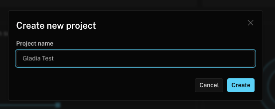
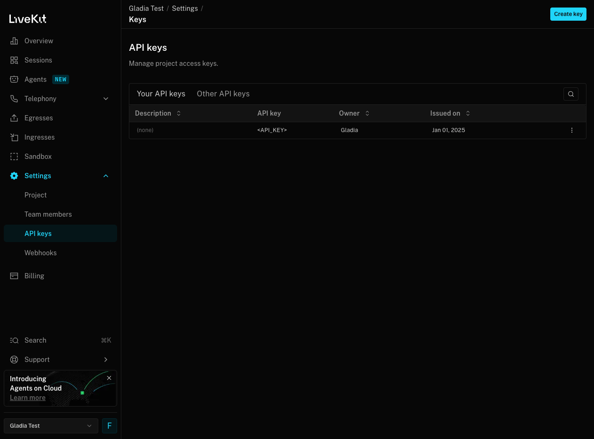
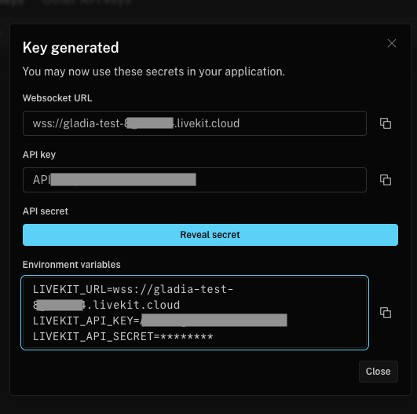
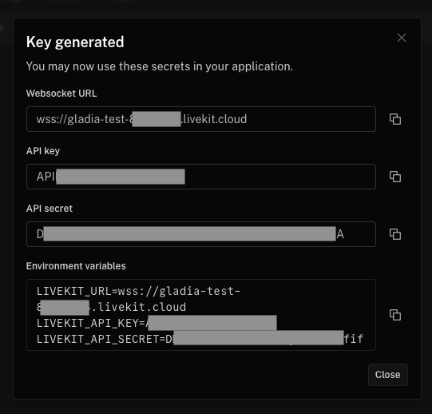
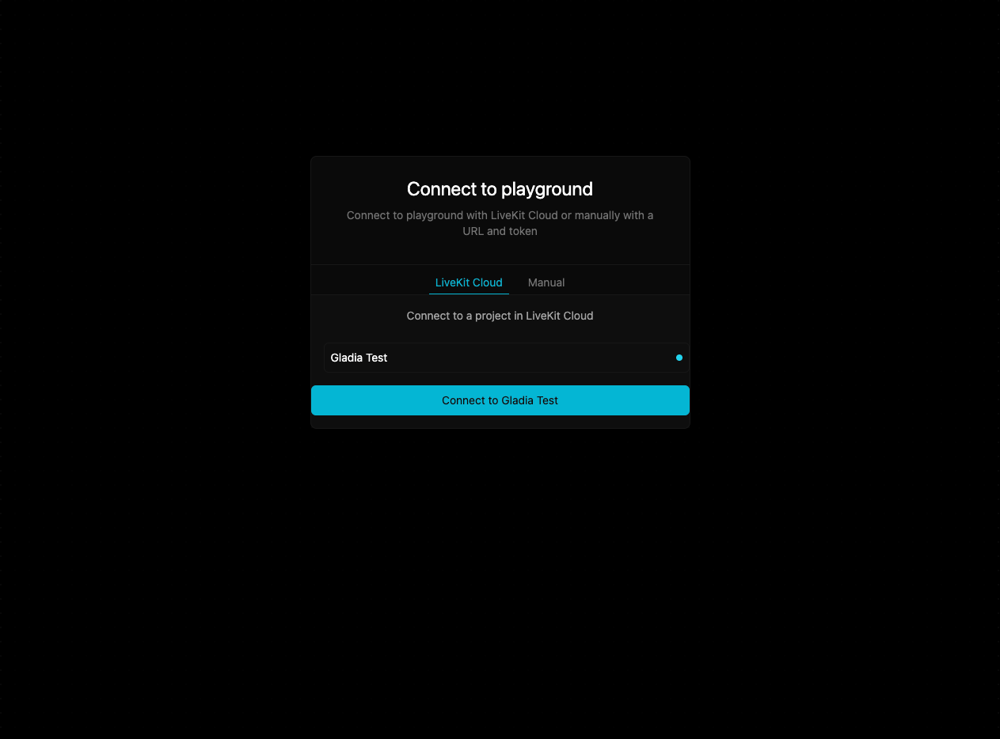
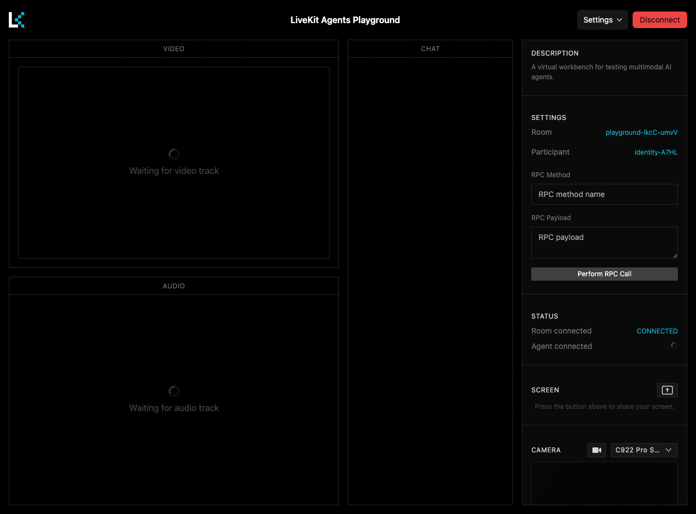
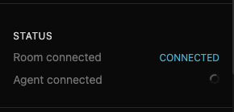
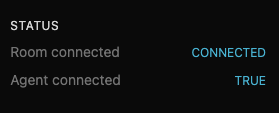
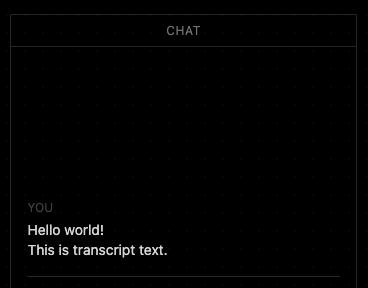

# LiveKit x Gladia Integration

[Gladia](https://www.gladia.io) is available as a Speech-to-Text plugin for LiveKit Agents. \
This example demonstrates how to integrate [Gladia](https://docs.livekit.io/agents/integrations/stt/gladia/) as a Speech-to-Text (STT) plugin within [LiveKit Agents](https://docs.livekit.io/agents/).


> [!NOTE]
> For simplicity and speed, we'll create an agent using LiveKit Cloud and the LiveKit Playground.


## 1. Set up a LiveKit Server

LiveKit can be deployed in two ways:
- **Self-hosted**: Use the [open-source LiveKit Server](https://github.com/livekit/livekit) on your own infrastructure.
- **Cloud**: Use [LiveKit Cloud](https://cloud.livekit.io/), the fastest and easiest option. Each project includes free monthly bandwidth and free transcoding credits.

\
**For this guide, we'll use LiveKit Cloud.**

1. Go to [cloud.livekit.io](https://cloud.livekit.io/) and create a new project with the name you want. \
&emsp; 

2. Navigate to **Settings > API Keys**. Open your key details by clicking on the row of the table. \
&emsp; 

3. Click on **Reveal secret** button to show your secret key. \
&emsp; 

4. Store your URL, key and secret, you will need them later. \
&emsp; 

## 2. Set up the Frontend with LiveKit Agents Playground

LiveKit offers SDKs across multiple environments, making it simple to build custom integrations.  
For quick testing, use the **LiveKit Agents Playground**, an interactive app to prototype and validate workflows.

1. Go to [agents-playground.livekit.io](https://agents-playground.livekit.io/), select the project you've just created, and click the **Connect to ...** button. \
&emsp; 
  
2. Once connected, you'll be redirected to the playground. Keep this page open — it will be used later to display the transcription. \
&emsp; 

---

## 3. Create a LiveKit Agent with Gladia STT
LiveKit provides many agent examples here: [LiveKit Agents Examples](https://github.com/livekit/agents/tree/main?tab=readme-ov-file#examples).

For this integration, we’ve built a simple **transcriber agent** using the Gladia plugin. This example is adapted from the LiveKit transcription project: https://github.com/livekit/agents/tree/main/examples/other/transcription


### Setup

#### Prerequisites

- A valid [Gladia API key](https://docs.gladia.io/)
- [Python uv](https://docs.astral.sh/uv/getting-started/installation/)

#### Installation

Clone the repository and install dependencies:

```bash
git clone https://github.com/gladiaio/gladia-samples.git
cd gladia-samples/integrations-examples/livekit-agent
uv sync
```

#### Create your environment file

```bash
cp .env.example .env
```

Open the **.env** file in your text editor and add your API keys:
```ini
GLADIA_API_KEY=your_gladia_api_key
LIVEKIT_URL=your_livekit_server_wss
LIVEKIT_API_KEY=your_livekit_api_key
LIVEKIT_API_SECRET=your_livekit_api_secret
```

Replace each placeholder with your actual API key from the respective service.

### Usage

Go back to the [agent playground](https://agents-playground.livekit.io/), it should still be connected to your LiveKit Cloud.

1. In the right column under **STATUS**, you'll see that the room is connected, but the agent is still loading. \
&emsp; 

2. To start the agent in development mode, run:
```bash
uv run --env-file=.env main.py dev
```

3. In the right column, you'll see that the agent is now connected. \
&emsp; 


4. You can start talking in your microphone, and the transcriptions will appear in the playground's chat column. \
&emsp; 
